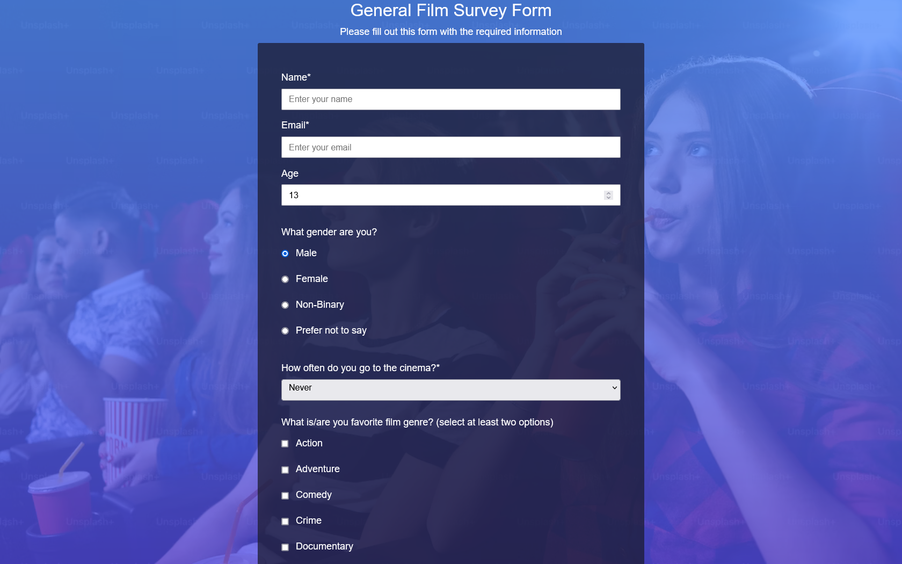
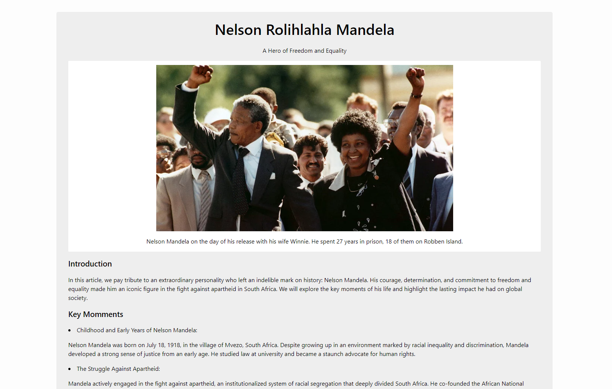
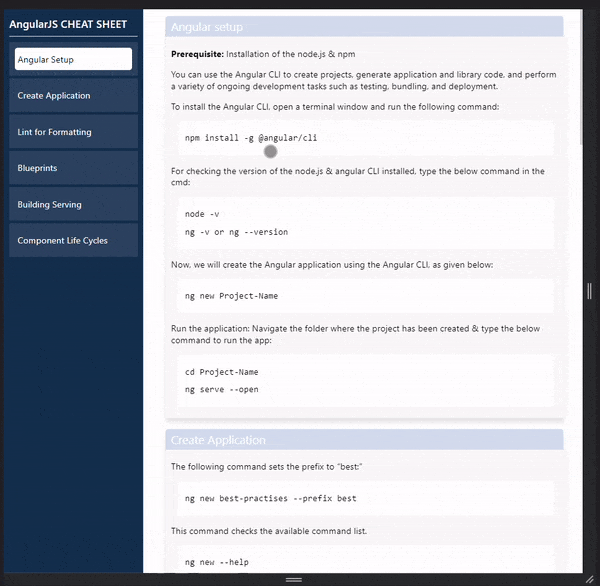
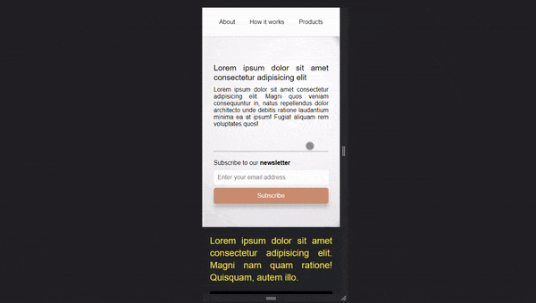

# FREECODECAMP CERTIFICATION PROJECT - RESPONSIVE WEB DESIGN | HTML | CSS 

## https://www.freecodecamp.org/learn/

---

## FIRST PROJECT

### SURVEY FORM SAMPLE - FILM SURVEY

#### OUTPUT

---

## SECOND PROJECT

### TRIBUTE PAGE - NELSON MANDELA

### OUTPUT

---

## THIRD PROJECT 

### DOCUMENTATION PAGE - ANGULAR JS CHEAT SHEET SAMPLE

#### OUTPUT

---

## FOURTH PROJECT

### LANDING PAGE SAMPLE - GRID / FLEXBOX LAYOUT

#### OUTPUT

---

## LAST PROJECT

---

## IMAGE REFERENCE

Illustration by [Cliquez ici](https://icons8.com/illustrations/author/Go8GMpKPAq1W "Polina M.") 

Illustration by [Cliquez ici](https://icons8.com/illustrations/author/zD2oqC8lLBBA "Icons 8") 

Illustration by [Cliquez ici](https://icons8.com/illustrations/author/GrbQqWBEhaDS "Liam Moore") 
